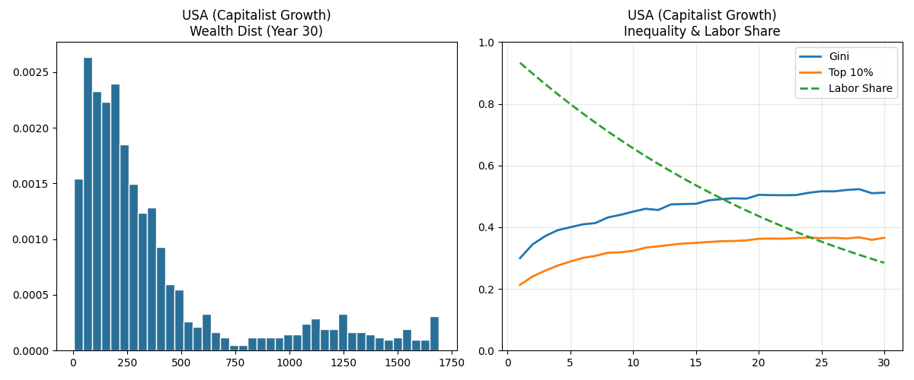
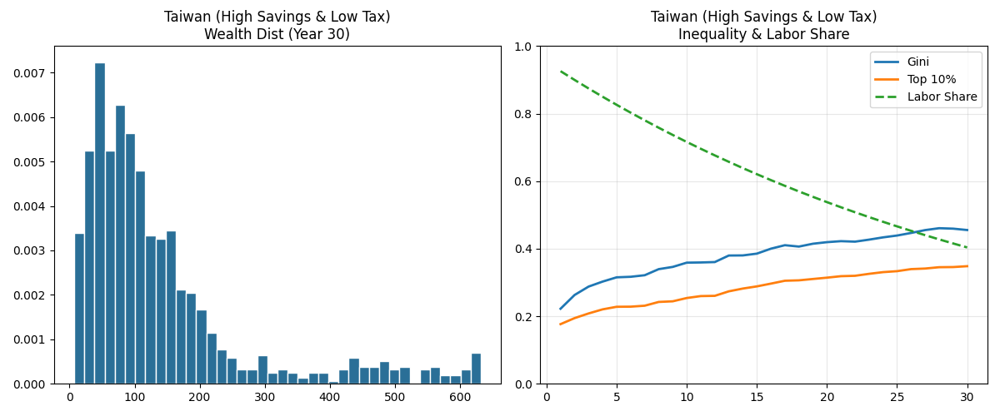
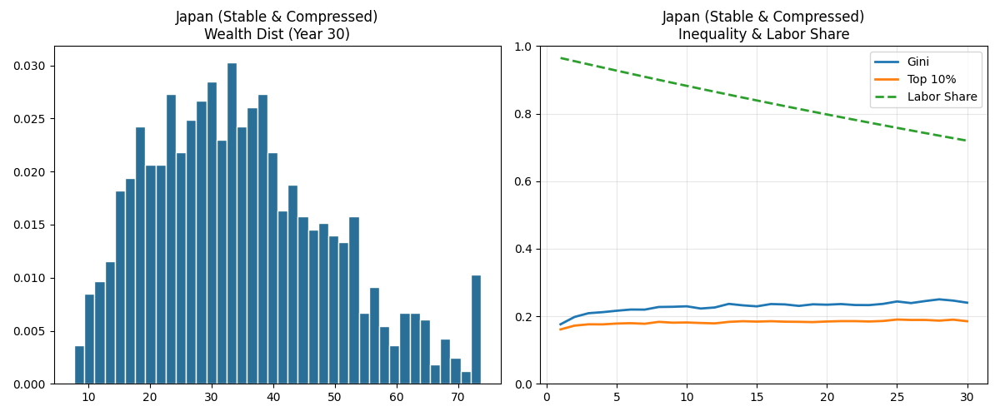
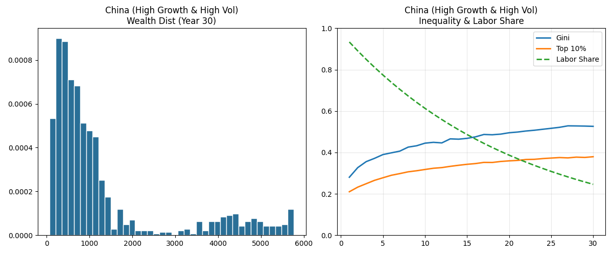

# 全球經濟模式模擬報告：美、台、日、中 (30年演變分析)

本報告利用代理人模型 (Agent-Based Model) 模擬了四種截然不同的國家經濟體制，觀察其在 30 年間的財富分配演變、基尼係數走勢以及勞動對經濟的貢獻度。

## 1. 國家模擬參數邏輯

| 項目 \ 國家 | 美國 (USA) | 台灣 (Taiwan) | 日本 (Japan) | 大陸 (China) |
| :--- | :--- | :--- | :--- | :--- |
| **年化 GDP 成長** | 2.5% (穩健) | 3.0% (中等) | 0.5% (停滯) | 5.5% (高成長) |
| **資本回報率** | 8.0% (股市強勁) | 6.0% (房產/半導體) | 2.0% (低利率) | 10.0% (高風險) |
| **勞動稅/資產稅** | 20% / 15% | 12% / 2% | 35% / 25% | 15% / 5% |
| **儲蓄行為** | 低儲蓄、極端化 | 中高儲蓄、穩定 | 極高儲蓄、平均 | 高儲蓄、內捲型 |
| **薪資差距 (Bonus)** | 4.0倍 (極大) | 2.5倍 (中等) | 1.5倍 (壓縮) | 3.5倍 (大) |

---

## 2. 模擬結果分析

### A. 美國模式 (USA) - 資本主義的加速器

*   **觀察**：基尼係數上升最快，且穩定在高位。
*   **特性**：由於極高的資本回報 (8%) 遠超勞動收入成長，且富人透過 98% 的儲蓄率避險，財富迅速向 1% 靠攏。勞動貢獻率 (Labor Share) 隨時間顯著稀釋。

### B. 台灣模式 (Taiwan) - 穩健勞動與輕資產稅

*   **觀察**：社會財富分佈較廣，基尼係數呈現階梯式穩定上升。
*   **特性**：2% 的極低資產稅使得財富累積後難以流回底層，但由於 35% 的高基礎儲蓄率，社會中產階級有一定的韌性，整體呈現「溫水煮青蛙」式的財富集中。

### C. 日本模式 (Japan) - 停滯中的極致公平

*   **觀察**：基尼係數最低，財富分佈最接近正態分佈。
*   **特性**：雖然 GDP 成長幾乎停滯，但透過高達 25% 的資產/遺產稅與薪資壓縮 (1.5x)，成功抑制了資本的吸血效應。社會極度穩定，但也缺乏爆發式財富增長。

### D. 大陸模式 (China) - 高增長下的兩極分化

*   **觀察**：總體財富暴增，但波動極大。
*   **特性**：5.5% 的 GDP 成長帶來了巨大的勞動收入增量，但 20% 的高勞動波動 (Labor Vol) 與高資本利得 (10%) 導致社會出現嚴重的分層。「內捲」體現在高儲蓄與高競爭並存。

---

## 3. 核心洞察

1.  **資本稅是公平的唯一煞車**：日本與美國的對比證明，不論 GDP 成長多少，沒有足夠的資產稅 (Japan 25% vs Taiwan 2%)，基尼係數終將失控。
2.  **勞動貢獻率 (Labor Share) 的警訊**：在所有高成長模式（中、美）中，勞動貢獻率都呈下降趨勢，代表「努力工作」越來越難趕上「資產增值」。
3.  **儲蓄斜率的階級固化**：美國的極低儲蓄上限 (Saving Min 2%) 導致底層一旦失業便徹底破產，是社會動盪的根源。
