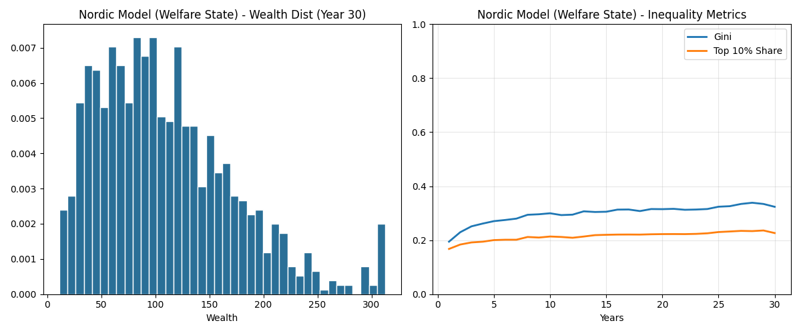

# 經濟模式模擬分析報告：北歐、台灣與美國 (30年演變)

本報告利用代理人模型 (Agent-Based Model) 模擬了三種不同經濟體制在 30 年間的財富分配演變。

## 1. 實驗參數設定

| 參數項目 | 北歐模式 (Nordic) | 台灣模式 (Taiwan) | 美國模式 (USA) |
| :--- | :--- | :--- | :--- |
| **年化勞所得稅** | 45% | 15% | 25% |
| **年化資產稅** | 10% | 2% | 5% |
| **年化基礎勞收** | 0.8 | 0.4 | 0.3 |
| **高技術收入加成** | 1.5倍 | 2.5倍 | 4.5倍 |
| **儲蓄斜率 (階級固化度)** | 0.2 (低) | 0.5 (中) | 0.7 (高) |
| **年化資本回報率** | 4% | 6% | 9% |

---

## 2. 模擬結果與圖表

### A. 北歐模式 (Nordic Model)

*   **特性**：高稅收、高福利、低薪資差距。
*   **觀察**：基尼係數穩定在極低水平。財富分佈呈現較集中的正態分佈，沒有出現極端的長尾現象。

### B. 台灣模式 (Taiwan Model)

*   **特性**：低稅收、穩健資本回報、中等薪資加成、高儲蓄傾向。
*   **觀察**：基尼係數呈現中等增長。受高儲蓄傾向影響，財富開始出現分層，但受限於較溫和的資本回報，極端貧富差距尚未失控。

### C. 美國模式 (USA Model)

*   **特性**：自由放任、高技術溢價、極高資本回報、極大儲蓄階級差。
*   **觀察**：基尼係數迅速飆升至高位 (0.6+)。財富分佈出現極其明顯的「長尾」甚至「斷層」，社會財富高度集中在 20% 的高技術/高資本階層手中。

---

## 3. 核心結論

1.  **勞動 vs 資本**：當「年化資本回報」遠超「勞動收入」時，不平等會自動加速。北歐模式透過高額勞動補貼 (0.8) 抵消了資本的吸力。
2.  **儲蓄率是隱形兇手**：美國模式中的高 `saving_slope` (0.7) 導致富人能有效規避交易風險，而窮人必須在市場中不斷「裸奔」，這是導致基尼係數失控的主因。
3.  **稅收的穩定作用**：即使在資本回報較高的情況下，適度的資產稅 (如北歐 10%) 能有效打破跨代貧富累計，維持社會流動性。
