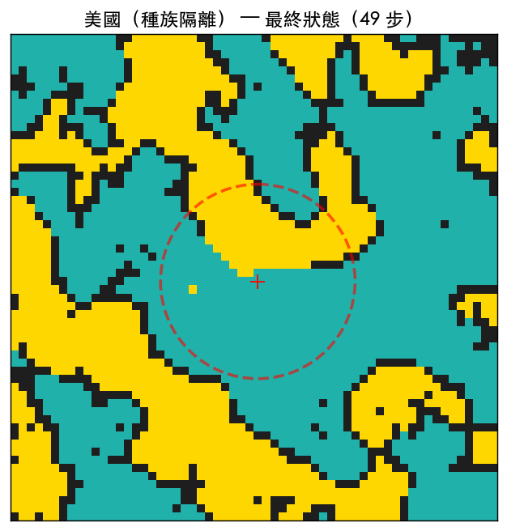
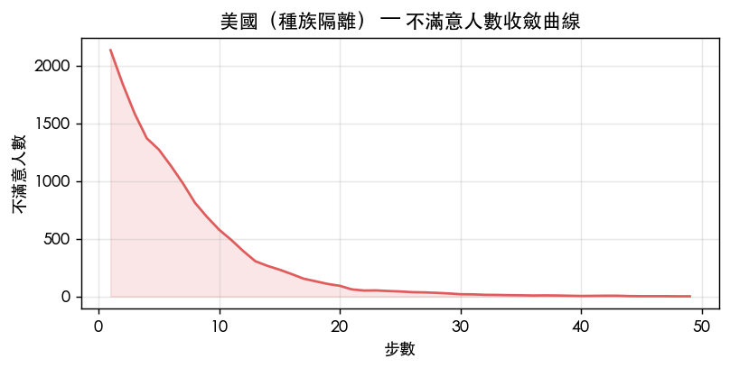
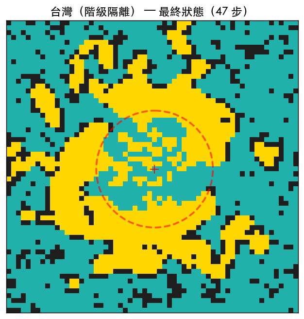
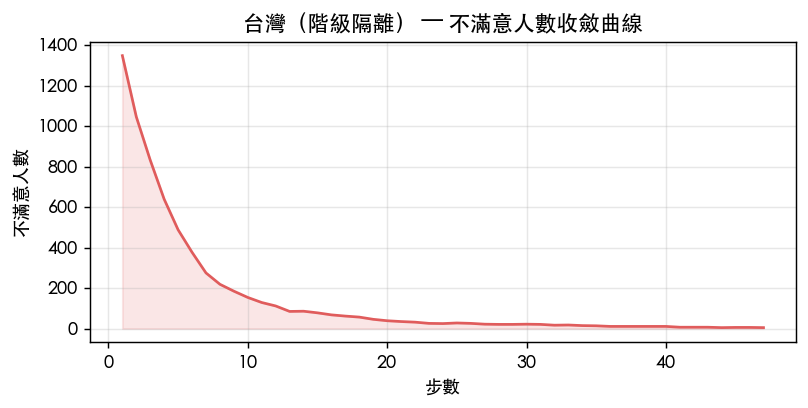

# 居住隔離模擬報告：美國 vs 台灣

生成日期：2026-03-08  
模型：Schelling Segregation Model（改良版，含 CBD 市中心效應）

---

## 模型說明

本模擬基於 Thomas Schelling（1971）提出的居住隔離模型：
每位居民若「同族鄰居比例」低於個人門檻，即視為不滿意並嘗試搬家。
即使門檻設定相當溫和，群體動態仍會放大成明顯的社會隔離現象。

### 改良參數

| 參數 | 意義 | 現實對應 |
|------|------|----------|
| `friction_cost` | 搬家阻力（0=無阻力，1=完全無法搬） | 房貸綁定、學區成本、交易稅 |
| `cbd_gravity` | 市中心吸引力（0=無，1=全往中心跑） | 捷運地段競爭、都市包容度 |

### 隔離指數說明

- **0.50**：完全隨機混居（理論下限）
- **0.70**：輕度隔離
- **0.85+**：強烈隔離板塊

---

## 美國（種族隔離）

### 參數設定與設計理由

| 參數 | 值 | 設計理由 |
|------|----|----------|
| `size` | 60 | 60×60 網格 |
| `empty_ratio` | 0.15 | 空屋率 15% |
| `group1_ratio` | 0.6 | 多數群體 60% / 少數 40% |
| `threshold_g1` | 0.65 | 多數群體滿意門檻 |
| `threshold_g2` | 0.65 | 少數群體滿意門檻 |
| `friction_cost` | 0.15 | 搬家阻力 |
| `cbd_gravity` | 0.2 | 市中心容忍度加成 |
| `cbd_gravity_g1` | 0.20 | Group1（窮人）搬家市中心偏好 |
| `cbd_gravity_g2` | 0.20 | Group2（富人）搬家市中心偏好 |
| `neighborhood` | moore | 8宮格鄰居 |
| `max_steps` | 300 | 最大步數 |

### 模擬結果

| 指標 | 數值 |
|------|------|
| 收斂步數 | 49 步 |
| 初始隔離指數 | 0.521 |
| 最終隔離指數 | 0.979 |
| 隔離指數上升 | +0.458 |
| 最終不滿意人數 | 1 / 3060 人 （0.0%）|

### 最終居住分布

> 藍綠色 = 群體 1（多數）；金色 = 群體 2（少數）；黑色 = 空屋
> 紅色虛線圓圈 = CBD 市中心容忍加成範圍

### 不滿意人數收斂曲線

---

## 台灣（階級隔離）

### 參數設定與設計理由

| 參數 | 值 | 設計理由 |
|------|----|----------|
| `size` | 60 | 60×60 網格 |
| `empty_ratio` | 0.15 | 空屋率 15% |
| `group1_ratio` | 0.65 | 多數群體 65% / 少數 35% |
| `threshold_g1` | 0.55 | 多數群體滿意門檻 |
| `threshold_g2` | 0.55 | 少數群體滿意門檻 |
| `friction_cost` | 0.5 | 搬家阻力 |
| `cbd_gravity` | 0.85 | 市中心容忍度加成 |
| `cbd_gravity_g1` | 0.20 | Group1（窮人）搬家市中心偏好 |
| `cbd_gravity_g2` | 0.95 | Group2（富人）搬家市中心偏好 |
| `neighborhood` | moore | 8宮格鄰居 |
| `max_steps` | 500 | 最大步數 |

### 模擬結果

| 指標 | 數值 |
|------|------|
| 收斂步數 | 47 步 |
| 初始隔離指數 | 0.543 |
| 最終隔離指數 | 0.921 |
| 隔離指數上升 | +0.378 |
| 最終不滿意人數 | 5 / 3060 人 （0.2%）|

### 最終居住分布

> 藍綠色 = 群體 1（多數）；金色 = 群體 2（少數）；黑色 = 空屋
> 紅色虛線圓圈 = CBD 市中心容忍加成範圍

### 不滿意人數收斂曲線

---

## 兩國比較

| 指標 | 美國 | 台灣 |
|------|------|------|
| 收斂步數 | 49 | 47 |
| 初始隔離指數 | 0.521 | 0.543 |
| 最終隔離指數 | 0.979 | 0.921 |
| 隔離指數上升幅度 | +0.458 | +0.378 |
| 最終不滿意比例 | 0.0% | 0.2% |
| 搬家阻力 | 0.15 （低） | 0.5 （高） |
| 市中心吸引力 | 0.2 （弱） | 0.85 （強） |

---

## 結論分析

### 美國

- **低搬家阻力**（0.15）：居民對不滿意環境快速反應，隔離板塊形成速度快
- **弱 CBD 效應**（0.2）：郊區化傾向使隔離從城市邊緣蔓延，缺乏混居緩衝區
- **多數/少數比 60%/40%**：少數群體較難在各處形成足夠規模的聚落，被擠壓到少數角落
- 最終隔離指數 **0.979**，呈現清晰的大型單色板塊

### 台灣

- **高搬家阻力**（0.5）：房貸綁定、學區成本使居民即使不滿意也傾向忍耐，隔離演化較慢
- **強 CBD 效應（非對稱）**：富人 cbd_gravity=0.95，窮人 cbd_gravity=0.20
  → 富人優先搶佔市中心，窮人被推向外圍郊區，形成「中心富人、外圍窮人」的同心圓結構
- **高搬家阻力**（0.5）：即使不滿意，仍有 50% 機率忍耐不動，隔離演化較慢
- 最終隔離指數 **0.921**，隔離現象較美國緩和，但具有明顯的經濟階層空間分化

### Schelling 核心洞察

兩個場景都印證了 Schelling 的原始發現：
**個人溫和的偏好（門檻 50~65%），在群體動態下會放大成遠超預期的社會隔離結構。**
政策意涵上，單純降低門檻（提倡包容）的效果有限；
提高搬家阻力（租金補貼、稅制改革）或強化 CBD 混居誘因，
才能從機制層面減緩隔離的自發性形成。