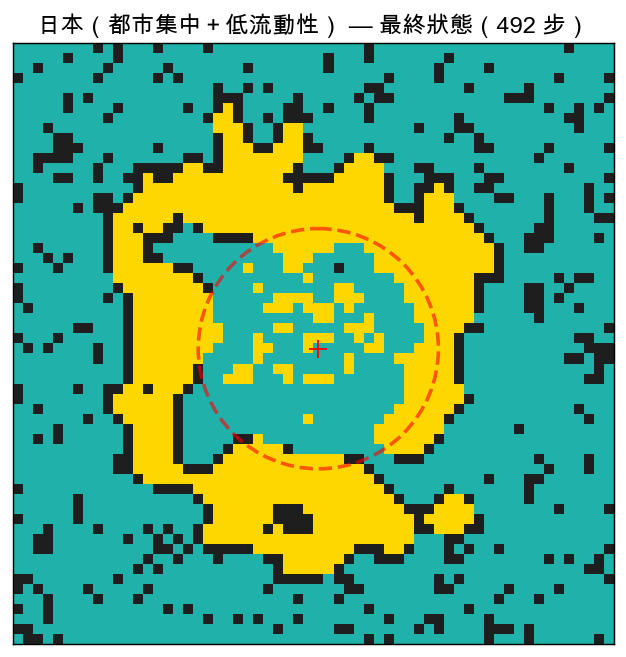
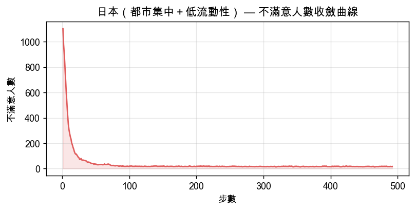

# 居住隔離模擬報告：美國 vs 台灣 vs 日本

生成日期：2026-03-08  
模型：Schelling Segregation Model（改良版，含 CBD 市中心效應）

---

## 模型說明

本模擬基於 Thomas Schelling（1971）提出的居住隔離模型：
每位居民若「同族鄰居比例」低於個人門檻，即視為不滿意並嘗試搬家。
即使門檻設定相當溫和，群體動態仍會放大成明顯的社會隔離現象。

### 改良參數

| 參數 | 意義 | 現實對應 |
|------|------|----------|
| `friction_cost` | 搬家阻力（0=無阻力，1=完全無法搬） | 房貸綁定、學區成本、交易稅 |
| `cbd_gravity` | 市中心吸引力（0=無，1=全往中心跑） | 捷運地段競爭、都市包容度 |

### 隔離指數說明

- **0.50**：完全隨機混居（理論下限）
- **0.70**：輕度隔離
- **0.85+**：強烈隔離板塊

---

## 美國（種族隔離）

### 參數設定與設計理由

| 參數 | 值 | 設計理由 |
|------|----|----------|
| `size` | 60 | 60×60 網格 |
| `empty_ratio` | 0.15 | 空屋率 15% |
| `group1_ratio` | 0.6 | 多數群體 60% / 少數 40% |
| `threshold_g1` | 0.65 | 多數群體滿意門檻 |
| `threshold_g2` | 0.65 | 少數群體滿意門檻 |
| `friction_cost` | 0.15 | 搬家阻力 |
| `cbd_gravity` | 0.2 | 市中心容忍度加成 |
| `cbd_gravity_g1` | 0.20 | Group1（窮人）搬家市中心偏好 |
| `cbd_gravity_g2` | 0.20 | Group2（富人）搬家市中心偏好 |
| `neighborhood` | moore | 8宮格鄰居 |
| `max_steps` | 300 | 最大步數 |

### 模擬結果

| 指標 | 數值 |
|------|------|
| 收斂步數 | 71 步 |
| 初始隔離指數 | 0.521 |
| 最終隔離指數 | 0.982 |
| 隔離指數上升 | +0.461 |
| 最終不滿意人數 | 0 / 3060 人 （0.0%）|

### 最終居住分布

> 藍綠色 = 群體 1（多數）；金色 = 群體 2（少數）；黑色 = 空屋
> 紅色虛線圓圈 = CBD 市中心容忍加成範圍

### 不滿意人數收斂曲線

---

## 台灣（階級隔離）

### 參數設定與設計理由

| 參數 | 值 | 設計理由 |
|------|----|----------|
| `size` | 60 | 60×60 網格 |
| `empty_ratio` | 0.15 | 空屋率 15% |
| `group1_ratio` | 0.65 | 多數群體 65% / 少數 35% |
| `threshold_g1` | 0.55 | 多數群體滿意門檻 |
| `threshold_g2` | 0.55 | 少數群體滿意門檻 |
| `friction_cost` | 0.5 | 搬家阻力 |
| `cbd_gravity` | 0.85 | 市中心容忍度加成 |
| `cbd_gravity_g1` | 0.20 | Group1（窮人）搬家市中心偏好 |
| `cbd_gravity_g2` | 0.95 | Group2（富人）搬家市中心偏好 |
| `neighborhood` | moore | 8宮格鄰居 |
| `max_steps` | 500 | 最大步數 |

### 模擬結果

| 指標 | 數值 |
|------|------|
| 收斂步數 | 500 步 |
| 初始隔離指數 | 0.543 |
| 最終隔離指數 | 0.919 |
| 隔離指數上升 | +0.376 |
| 最終不滿意人數 | 8 / 3060 人 （0.3%）|

### 最終居住分布

> 藍綠色 = 群體 1（多數）；金色 = 群體 2（少數）；黑色 = 空屋
> 紅色虛線圓圈 = CBD 市中心容忍加成範圍

### 不滿意人數收斂曲線

---

## 日本（都市集中＋低流動性）

### 參數設定與設計理由

| 參數 | 值 | 設計理由 |
|------|----|----------|
| `size` | 60 | 60×60 網格 |
| `empty_ratio` | 0.14 | 空屋率 14% |
| `group1_ratio` | 0.75 | 多數群體 75% / 少數 25% |
| `threshold_g1` | 0.6 | 多數群體滿意門檻 |
| `threshold_g2` | 0.65 | 少數群體滿意門檻 |
| `friction_cost` | 0.65 | 搬家阻力 |
| `cbd_gravity` | 0.9 | 市中心容忍度加成 |
| `cbd_gravity_g1` | 0.15 | Group1（窮人）搬家市中心偏好 |
| `cbd_gravity_g2` | 0.95 | Group2（富人）搬家市中心偏好 |
| `neighborhood` | moore | 8宮格鄰居 |
| `max_steps` | 500 | 最大步數 |

### 模擬結果

| 指標 | 數值 |
|------|------|
| 收斂步數 | 492 步 |
| 初始隔離指數 | 0.629 |
| 最終隔離指數 | 0.951 |
| 隔離指數上升 | +0.322 |
| 最終不滿意人數 | 17 / 3096 人 （0.5%）|

### 最終居住分布

> 藍綠色 = 群體 1（多數）；金色 = 群體 2（少數）；黑色 = 空屋
> 紅色虛線圓圈 = CBD 市中心容忍加成範圍

### 不滿意人數收斂曲線

---

## 三國比較

| 指標 | 美國 | 台灣 | 日本 |
|------|------|------|------|
| 收斂步數 | 71 | 500 | 492 |
| 初始隔離指數 | 0.521 | 0.543 | 0.629 |
| 最終隔離指數 | 0.982 | 0.919 | 0.951 |
| 隔離指數上升幅度 | +0.461 | +0.376 | +0.322 |
| 最終不滿意比例 | 0.0% | 0.3% | 0.5% |
| 搬家阻力 | 0.15（低） | 0.5（中高） | 0.65（極高） |
| 市中心吸引力 | 0.2（弱，郊區化） | 0.85（強） | 0.9（極強，一極集中） |
| 富人市中心偏好 | 0.20 | 0.95 | 0.95 |
| 窮人市中心偏好 | 0.20 | 0.20 | 0.15 |

---

## 結論分析

### 美國

- **低搬家阻力**（0.15）：居民對不滿意環境快速反應，隔離板塊形成速度快
- **弱 CBD 效應**（0.2）：郊區化傾向（suburbanization）使族群隔離從城市邊緣蔓延，缺乏市中心混居緩衝區
- **種族比例 60%/40%**：少數群體難以在各處形成足夠規模的聚落
- 最終隔離指數 **0.982**，呈現清晰的大型單色板塊，對應真實美國城市的種族隔離地圖

### 台灣

- **中高搬家阻力**（0.5）：高房價與房貸綁定使居民傾向忍耐，隔離演化較緩
- **強 CBD 效應（非對稱）**：高所得 cbd_gravity=0.95，一般所得 cbd_gravity=0.20
  → 高所得優先搶佔市中心，一般所得被推向外圍，形成「中心富人、外圍窮人」同心圓結構
- 最終隔離指數 **0.919**，隔離現象以經濟階層為主要分化軸，對應台北大安/文山的所得空間分布

### 日本

- **極高搬家阻力**（0.65）：終身雇用文化、老齡化社會與低持有稅使居民幾乎不主動搬家
- **極強一極集中**（0.9）：東京向心力壓倒一切，模型中幾乎所有可移動者都趨向都心
- **極低窮人中心偏好**（0.15）：一般勞動者退往郊外衛星市鎮（埼玉、千葉、神奈川），都心留給專業階層
- 高阻力使隔離形成速度最慢，但最終可能形成**結構性固化**：一旦形成即難以改變
- 最終隔離指數 **0.951**，反映「遲緩但固化」的空間分化特徵

### Schelling 核心洞察

三個場景都印證了 Schelling 的原始發現：
**個人溫和的偏好（門檻 55~65%），在群體動態下會放大成遠超預期的社會隔離結構。**

三國的差異在於**驅動機制不同**：
- 美國：偏好導向（主動選擇同族鄰居）
- 台灣：價格導向（高所得搶市中心，低所得被動外移）
- 日本：慣性主導（極低流動性使現有格局固化，變動主要來自年輕世代首次置業）

政策意涵：單純提倡包容（降低門檻）效果有限；
針對機制對症下藥——提高美國搬家成本（租金穩定）、台灣補貼窮人進入市中心、日本促進居住流動——才能從根本緩解隔離。